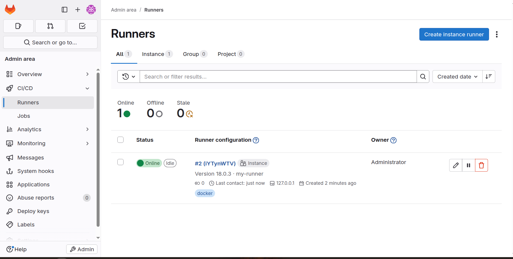
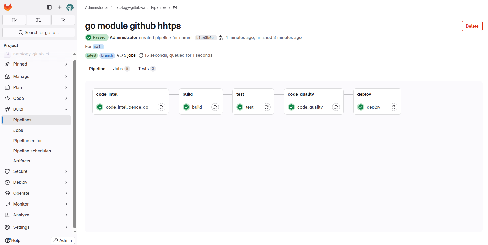
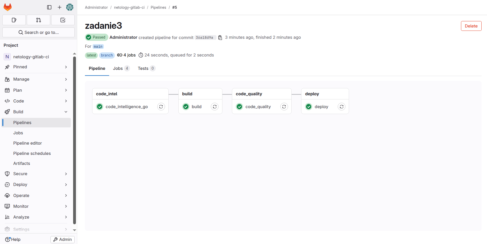
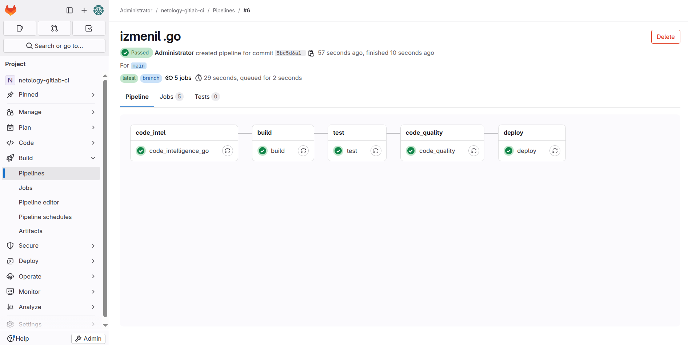

# 🧪 Практическое задание: «GitLab CI/CD»  
### 👤 Выполнил: Колыванов Антон  

---

## ✅ Задание 1  

**Что нужно сделать:**  

- Развернуть GitLab локально с помощью `Vagrantfile` и инструкции из репозитория;  
- Создать новый проект и пустой репозиторий;  
- Зарегистрировать `gitlab-runner` для проекта и запустить его в режиме **Docker**;  
- Разрешается использовать ту же ВМ, где работает GitLab.  

**Результат:**  
📎 *Скриншот с настройками раннера в проекте:*  

  
 
## ✅ Задание 2 

**Что нужно сделать:**  

- Изменить `origin` и запушить локальный репозиторий на GitLab;  
- Создать `.gitlab-ci.yml` с описанием всех необходимых этапов (на твой выбор);  
- Приложить файл конфигурации и скриншоты успешных сборок.  

**Результат:**  
📎 *Скриншот выполнения Pipeline:*  

  

📄 *Содержимое `.gitlab-ci.yml`:*  

```yaml
stages:
  - code_intel
  - build
  - test
  - code_quality
  - deploy

code_intelligence_go:
  stage: code_intel
  image: sourcegraph/lsif-go:v1
  tags:
    - docker
  before_script:
    - git remote set-url origin https://github.com/netology-code/sdvps-materials.git
    - go mod edit -module github.com/netology-code/sdvps-materials
    - go mod tidy
  script:
    - lsif-go

build:
  stage: build
  image: docker:latest
  tags:
    - docker
  script:
    - docker info
    - echo "Building the project..."

test:
  stage: test
  image: docker:latest
  tags:
    - docker
  script:
    - echo "Running tests..."
    - echo "Tests passed!"

code_quality:
  stage: code_quality
  image: registry.gitlab.com/gitlab-org/ci-cd/codequality:0.96.0-gitlab.1
  tags:
    - docker
  script:
    - echo "Running code quality scan..."

deploy:
  stage: deploy
  image: docker:latest
  tags:
    - docker
  script:
    - echo "Deploying to production..."

## 🌟 Задание 3*

Измените CI так, чтобы:

- этап сборки запускался сразу, не дожидаясь результатов тестов;  
- тесты запускались только при изменении файлов с расширением `*.go`.

---

**Результат:**  
  
📄 *Содержимое `.gitlab-ci.yml`:*   
  
```
stages:
  - code_intel
  - build
  - test
  - code_quality
  - deploy

code_intelligence_go:
  stage: code_intel
  image: sourcegraph/lsif-go:v1
  tags:
    - docker
  before_script:
    - git remote set-url origin https://github.com/netology-code/sdvps-materials.git
    - go mod edit -module github.com/netology-code/sdvps-materials
    - go mod tidy
  script:
    - lsif-go

build:
  stage: build
  image: docker:latest
  tags:
    - docker
  script:
    - docker info
    - echo "Building the project..."
  # запускается всегда и сразу

test:
  stage: test
  image: docker:latest
  tags:
    - docker
  script:
    - echo "Running tests..."
    - echo "Tests passed!"
  only:
    changes:
      - "**/*.go"
  #  файлы с расширением .go

code_quality:
  stage: code_quality
  image: registry.gitlab.com/gitlab-org/ci-cd/codequality:0.96.0-gitlab.1
  tags:
    - docker
  script:
    - echo "Running code quality scan..."

deploy:
  stage: deploy
  image: docker:latest
  tags:
    - docker
  script:
    - echo "Deploying to production..."

```
📎 *Скриншот выполнения: Pipline этап сборки запускался сразу, не дожидаясь результатов тестов:*    

  

📎 *Скриншот выполнения: Pipline тесты запускались только при изменении файлов с расширением *.go:*  
 

